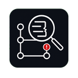
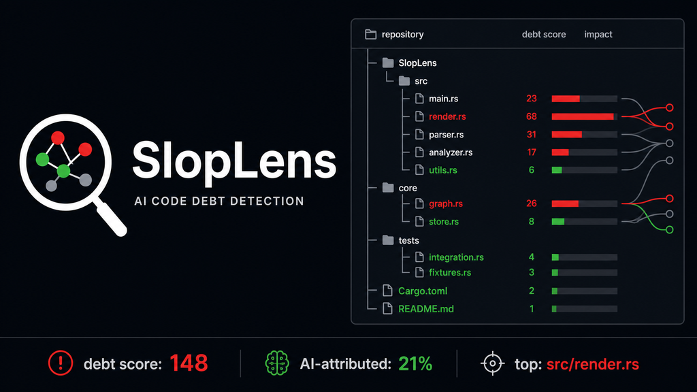

<p align="center">
  
</p>

# SlopLens

SlopLens tells you WHO introduced debt, WHEN, and whether AI was suspected — not just WHERE it is.

Who broke your codebase, and was it AI?

<p align="center">
  
</p>

SlopLens 是一个面向 git 仓库的代码债归因平台：它不只指出代码债在哪里，还会追溯是谁在何时引入，以及该提交是否存在 AI 辅助嫌疑。

Compared with vibecheck's current snapshot checks, Git AI's provenance view, and GitClear's ROI reporting, SlopLens sits at the intersection: historical attribution plus debt detection.

对比 vibecheck 的当前快照检查、Git AI 的溯源视角和 GitClear 的 ROI 报告，SlopLens 的定位是历史归因 + 债务检测。

## Install / 安装

```bash
cargo install --path .
```

Or run it directly from the repository:

也可以在源码仓库中直接运行：

```bash
cargo run -- scan --repo /path/to/repo
```

## Usage / 用法

Scan the current repository:

扫描当前仓库：

```bash
slop-lens scan --repo .
```

Save a debt baseline:

保存当前债务基线：

```bash
slop-lens baseline --repo . --save
```

Scan a commit range. When `--from` or `--to` is provided, SlopLens analyzes only source files changed in that range:

扫描提交范围。传入 `--from` 或 `--to` 时，SlopLens 只分析该范围内变更过的源码文件：

```bash
slop-lens scan --repo /path/to/repo --from HEAD~5 --to HEAD
```

Write an HTML report:

输出 HTML 报告：

```bash
slop-lens scan --repo /path/to/repo --format html --out slop-lens-report.html
```

Supported formats:

支持的输出格式：

```text
terminal, summary, html, json, sarif
```

Use `summary` for compact CI comments or quick terminal checks:

`summary` 适合 CI 评论或快速概览：

```bash
slop-lens scan --repo . --format summary
```

Download release binaries from the GitHub Releases page for your platform, then put the `slop-lens` binary on your `PATH`.

也可以从 GitHub Releases 下载对应平台的发布二进制，并把 `slop-lens` 放到 `PATH` 中。

## Demo / 演示

The demo command creates a synthetic temporary git repository, scans it, prints or writes the report, and removes the temporary repository before exiting. Demo output is marked as a synthetic sample because its debt index may saturate by design.

`demo` 命令会创建一个临时合成 git 仓库，完成扫描并输出报告，然后在退出前删除临时仓库。

```bash
slop-lens demo
slop-lens demo --format html --out demo-report.html
```

## Rules / 规则

`SL-001` unused candidate: private functions or methods with no references across analyzed files.

`SL-001` 未使用候选：在已分析文件中没有引用的私有函数或方法。

`SL-002` duplicate block: functions with highly similar normalized token bodies.

`SL-002` 重复代码块：规范化 token 后主体高度相似的函数。

`SL-003` complexity candidate: long functions, deep nesting, or high approximate cyclomatic complexity. Python nesting is estimated from indentation.

`SL-003` 复杂度候选：函数过长、嵌套过深或近似圈复杂度过高。Python 嵌套基于缩进估算。

`SL-004` comment inflation candidate: current comment/code ratio is much higher than historical added-line baseline.

`SL-004` 注释膨胀候选：当前注释/代码比例明显高于历史新增行基线。

## Configuration / 配置

SlopLens reads `.sloplens.yml` from the scanned repository. `ignore_paths` extends the default ignores (`vendor`, `generated`, `dist`, `build`, `target`, `node_modules`). `rules` can disable a rule or tune a rule threshold.

SlopLens 会读取扫描仓库根目录下的 `.sloplens.yml`。`ignore_paths` 会追加到默认忽略目录；`rules` 可以关闭规则或调整阈值。

```yaml
ignore_paths:
  - fixtures/**
  - third_party
rules:
  SL-001:
    enabled: true
  SL-002:
    enabled: true
  SL-003:
    enabled: true
    threshold: 80
  SL-004:
    enabled: false
```

Currently `threshold` is used by `SL-003` as the long-function line threshold.

当前 `threshold` 用于 `SL-003`，表示长函数行数阈值。

## Language Support / 语言支持

Supported source extensions are `.rs`, `.go`, `.py`, `.js`, and `.ts`.

当前支持的源码扩展名为 `.rs`、`.go`、`.py`、`.js` 和 `.ts`。

```text
Rust: tree-sitter parser, mature
Go: tree-sitter parser, mature
Python: fallback parser, experimental
JavaScript: fallback parser, experimental
TypeScript: fallback parser, experimental
```

## AI Attribution / AI 归因

SlopLens treats explicit metadata as strong evidence, including AI-related trailers, Copilot mentions, `Generated-by: AI`, `AI-Assisted`, and GitHub web authoring metadata. Burst timing alone is not used as an AI signal; it only contributes a small weak signal when the commit is also large and touches multiple files.

SlopLens 将明确元数据视为强信号，例如 AI 相关 trailer、Copilot 提及、`Generated-by: AI`、`AI-Assisted` 和 GitHub web authoring 元数据。单纯的短时间连续提交不会被当作 AI 信号；只有同时满足大 diff、多文件等条件时，才会贡献很小的弱信号。

## Debt Index / 债务指数

Debt index scale:

债务指数标尺：

```text
0-40 low
40-70 medium
>70 high
```

The debt index normalizes the underlying debt score by repository size and clamps it to 0-100.

债务指数会按仓库规模归一化底层债务分数，并限制在 0-100。

## CI / 持续集成

Recommended checks:

推荐检查：

```bash
cargo fmt --check
cargo clippy --all-targets -- -D warnings
cargo test
cargo build
```

SARIF output can be uploaded by CI systems that support code scanning:

支持代码扫描的 CI 系统可以上传 SARIF 输出：

```bash
slop-lens scan --repo . --format sarif --out slop-lens.sarif
```

Fail a CI job on severe findings or a debt budget:

按严重问题或债务预算让 CI 失败：

```bash
slop-lens scan --repo . --fail-on error
slop-lens scan --repo . --fail-on warning
slop-lens scan --repo . --max-debt 50
slop-lens scan --repo . --format summary --max-debt 50
```
